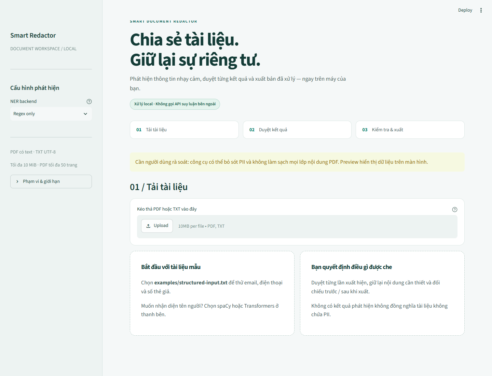
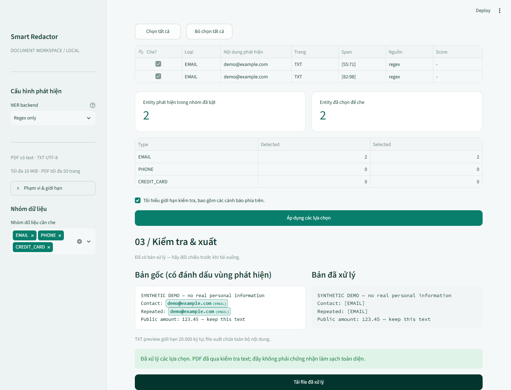
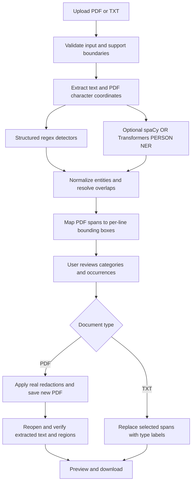

# Smart Document Redactor

**Review sensitive information before sharing a document.**

A local-first Python application that detects personally identifiable information (PII) in text-based PDFs and UTF-8 text files, lets users review individual findings, and exports redacted documents.

Built with **Streamlit · spaCy · Hugging Face Transformers · pdfplumber · PyMuPDF · pytest**.

> **Scope:** English-language portfolio MVP, tested on Windows with Python 3.13.14. This is a risk-reduction tool—not a comprehensive PDF sanitizer, a guarantee of complete PII detection, or a claim of GDPR compliance.

## Overview

Sharing reports, correspondence, or sample documents can unintentionally expose names and contact details. Smart Document Redactor combines structured pattern detection with optional named entity recognition, while keeping the user in control of what is removed.

The project focuses on three engineering concerns:

- **Occurrence-level control:** redact one occurrence without automatically removing every identical string.
- **Actual PDF redaction:** remove selected text through PyMuPDF's redaction API rather than merely covering it visually.
- **Verifiable behavior:** test extraction, detection, mapping, selection, and output verification independently.

## Features

- Upload text-based **PDF** or **UTF-8 TXT** files.
- Choose **regex only**, **spaCy**, or **Transformers**; only the selected NER backend runs.
- Inspect entity type, content, page, offsets, detection source, and confidence when available.
- Enable detection categories and select individual occurrences for removal.
- Preview PDFs before and after processing, one page at a time.
- Preview TXT replacements and export labels such as `[PERSON]` and `[EMAIL]`.
- View detection and selection counts by entity type.
- Invalidate stale output when the document, backend, or selection changes.
- Reject unsupported input or failed PDF verification rather than silently returning a successful result.
- Process documents locally without calling an external inference API.

### Supported entities

| Entity | Detection method | Support boundary |
|---|---|---|
| `PERSON` | spaCy or Transformers NER | English names; requires an installed local model |
| `EMAIL` | Regex and syntax checks | Conservative ASCII email patterns; not a complete RFC parser |
| `PHONE` | Regex and structural checks | Formatted North American numbers, optionally with extensions |
| `CREDIT_CARD` | Regex and Luhn validation | 13–19 digits; checksum validity does not prove a number is a real card |
| `ADDRESS` | Experimental regex | Selected US-style street-address patterns; opt-in in the UI |

Locations, amounts, dates, and arbitrary numbers are **not automatically classified as sensitive information**. False positives and false negatives remain possible.

## Quick start

### Requirements

- **Python 3.13** — verified with 3.13.14; the package currently requires `>=3.13,<3.14`.
- [uv](https://docs.astral.sh/uv/) or Python's built-in `venv` and `pip`.
- Internet access for initial dependency/model installation only.

The commands below use **Windows PowerShell**, the tested environment. Other operating systems have not been validated.

### 1. Install the core application

Download or clone this repository, then run from its root directory:

```powershell
cd smart-document-redactor
uv venv --python 3.13
uv pip install -e ".[dev]"
```

Alternatively, install the recorded core dependency snapshot:

```powershell
uv pip install -r requirements-lock.txt
```

Without uv:

```powershell
py -3.13 -m venv .venv
.\.venv\Scripts\python.exe -m pip install -e ".[dev]"
```

### 2. Start the application

```powershell
.\.venv\Scripts\python.exe -m streamlit run app.py
```

Open **http://127.0.0.1:8501**.

Run from the repository root so Streamlit loads `.streamlit/config.toml`. The checked-in configuration binds the server to localhost and disables Streamlit usage statistics.

**Regex-only mode does not require NLP models.** To detect names, follow the optional setup below.

### 3. Install optional NER backends

```powershell
uv pip install -e ".[dev,ner]"
```

Install the spaCy model explicitly:

```powershell
uv pip install "https://github.com/explosion/spacy-models/releases/download/en_core_web_sm-3.8.0/en_core_web_sm-3.8.0-py3-none-any.whl"
```

Download the Transformers model explicitly:

```powershell
.\.venv\Scripts\python.exe scripts/download_transformers.py
```

| Backend | Model field in the UI |
|---|---|
| spaCy | `en_core_web_sm` |
| Transformers | `models/bert-base-NER` |

The download script pins `dslim/bert-base-NER` to commit `d1a3e8f13f8c3566299d95fcfc9a8d2382a9affc`. Inference loads local files only, uses safetensors for the Transformers model, and does not enable remote model code. Missing models produce an error; the application does not silently fall back to regex while claiming to have checked names.

`requirements-ner-lock.txt` records the tested NLP environment. Both dependency snapshots are Windows environment snapshots, **not cross-platform, hash-locked dependency manifests**. Model weights are excluded from Git.

## Usage and demo

1. Select a backend. Start with **Regex only** for the quickest demo.
2. Upload a sample document from `examples/`.
3. Choose entity categories. Enable `ADDRESS` explicitly if needed.
4. Review the findings and deselect occurrences you want to retain.
5. Acknowledge the processing limitations and apply the selection.
6. Inspect the before/after preview and download the output.

Changing categories resets occurrence selection to the findings in the new categories. Changing selections removes the previous output until processing is applied again. Selecting no findings exports without removing detected entities and displays a warning.

### Included examples

| File | Purpose |
|---|---|
| [`examples/synthetic-input.pdf`](examples/synthetic-input.pdf) | PDF with repeated email occurrences |
| [`examples/synthetic-redacted.pdf`](examples/synthetic-redacted.pdf) | Verified redacted PDF example |
| [`examples/synthetic-input.txt`](examples/synthetic-input.txt) | TXT occurrence-selection example |
| [`examples/structured-input.txt`](examples/structured-input.txt) | Email, phone, sandbox card, and experimental address |
| [`examples/structured-redacted.txt`](examples/structured-redacted.txt) | Corresponding labeled TXT output |

Example input, using synthetic data:

```text
Email: demo@example.com
Phone: +1 202-555-0100
Test card: 4111 1111 1111 1111
Experimental address: 123 Example Street, Apt 4
Public content: London, amount 123.45, date 2026-09-05
```

Output when all four applicable categories and findings are selected:

```text
Email: [EMAIL]
Phone: [PHONE]
Test card: [CREDIT_CARD]
Experimental address: [ADDRESS]
Public content: London, amount 123.45, date 2026-09-05
```

Regenerate the synthetic PDF pair:

```powershell
.\.venv\Scripts\python.exe examples/generate_samples.py
```

**Visual demo:** the current workspace has a local teal theme, sidebar configuration, clear workflow sections, and before/after empty states. Screenshots below were captured from the running app using synthetic data, not design mockups.





Automated real-browser smoke (optional Playwright, installed Microsoft Edge on Windows):

```powershell
uv pip install playwright==1.62.0
.\.venv\Scripts\python.exe scripts/smoke_browser.py
```

Verified real browser TXT upload → acknowledgment → processing → downloaded content, plus no document-level horizontal overflow at a 390px viewport. This does not cover PDF browser downloads, every browser, or a full accessibility audit. Occurrence selection remains the native multiselect, not an editable checkbox grid. No recorded GIF yet.

## Architecture



Streamlit handles presentation and session state. Processing logic is independent of the UI; there is no database, authentication service, vector store, or separate API server.

### Project structure

```text
smart-document-redactor/
├── app.py                         # Streamlit interface
├── src/smart_redactor/
│   ├── schemas.py                 # Shared entity and document types
│   ├── pipeline.py                # PDF analysis and processing orchestration
│   ├── text.py                    # UTF-8 TXT analysis and replacement
│   ├── preview.py                 # Bounded, single-page PDF rendering
│   ├── evaluation.py              # Exact entity-level metrics
│   ├── extraction/pdf.py          # PDF validation and character mapping
│   ├── detection/
│   │   ├── email.py
│   │   ├── structured.py          # Validation and overlap policy
│   │   └── ner.py                 # Local model adapters and chunking
│   └── redaction/
│       ├── pdf.py
│       └── verification.py
├── tests/                         # Unit, integration, and AppTest coverage
├── examples/                      # Synthetic documents and outputs
├── scripts/                       # Explicit model setup and smoke checks
├── evaluation/                    # Gold datasets, runner, and reports
├── .streamlit/config.toml
├── pyproject.toml
├── requirements-lock.txt
└── requirements-ner-lock.txt
```

### Entity contract

```text
entity_id, type, text, start, end, page, boxes, source, confidence
```

- Offsets use half-open intervals `[start, end)` within each PDF page or the full TXT text.
- PDF pages are numbered from 1; TXT page is `null`.
- Each occurrence has a document-scoped ID. Identical strings at different positions remain separate findings.
- PDF entities may have multiple boxes, particularly across lines; TXT entities have no boxes.
- Sources distinguish `regex`, `spacy`, and `transformers`.
- Regex and spaCy confidence values are `null`. Transformers retains the aggregated entity score, which is **not a calibrated probability**.

## Engineering decisions and trade-offs

### Map occurrences, not global string matches

PDF text and its character-coordinate map are built together from pdfplumber characters. Selected spans map directly to those characters instead of searching every occurrence of a string. Boxes are grouped by line and proximity rather than creating one large rectangle across unrelated content.

This provides precise occurrence control on supported layouts, but geometric row ordering is not a complete solution for complex PDF reading order.

### Resolve overlaps deterministically

The priority order is:

```text
CREDIT_CARD → EMAIL → PHONE → ADDRESS → PERSON
```

Within the same priority, longer spans win, followed by earlier offsets and deterministic tie-breaking. Duplicate spans are removed; adjacent spans remain distinct. Regions are not merged indiscriminately.

Resolution happens before the UI category filter. Disabling a higher-priority category does not reinterpret its suppressed overlap as another category.

### Remove PDF text, then verify

Selected regions are applied through PyMuPDF redaction annotations and `apply_redactions`. Output is serialized into a new, non-incremental PDF using `garbage=4` and `deflate=True`.

Verification reopens the output and checks:

- Selected target regions contain no extractable text.
- A selected value is absent globally when every detected occurrence of that value was selected.
- Unselected detected entities remain in their corresponding regions.

This avoids treating an intentionally retained duplicate as a failed redaction. Mapping or verification failures block successful output. PDFs containing existing redaction annotations are rejected to avoid applying unrelated pre-existing regions.

**Text verification and garbage collection do not prove comprehensive PDF sanitization.**

### Keep NER optional and bound model input

spaCy uses overlapping character windows. Transformers starts with bounded character windows and shrinks them against the actual token limit before inference, rather than silently truncating overlength input. Offsets are restored to the source text and duplicate results are resolved.

Overlap improves boundary context but does not guarantee complete recognition of entities crossing chunk boundaries. Structured detectors remain identical across the two NER configurations.

## Evaluation

The initial evaluation uses **6 synthetic dev documents and 24 synthetic test documents**. The test split contains **1,440 characters and 35 gold entities**, including 13 `PERSON` entities. No model fine-tuning was performed, so no training split is included.

Gold spans were authored separately from detector predictions. Person names and complete texts differ across splits, but related synthetic patterns remain. Known unsupported phone/address cases are retained rather than excluded to improve scores.

### Observed entity-level results

Exact type-and-span matching; values are percentages.

| Entity | Gold count | spaCy Precision | spaCy Recall | spaCy F1 | Transformers Precision | Transformers Recall | Transformers F1 |
|---|---:|---:|---:|---:|---:|---:|---:|
| PERSON | 13 | 90.00 | 69.23 | 78.26 | 100.00 | 100.00 | 100.00 |
| EMAIL | 5 | 100.00 | 100.00 | 100.00 | 100.00 | 100.00 | 100.00 |
| PHONE | 6 | 100.00 | 66.67 | 80.00 | 100.00 | 66.67 | 80.00 |
| CREDIT_CARD | 4 | 100.00 | 100.00 | 100.00 | 100.00 | 100.00 | 100.00 |
| ADDRESS | 7 | 80.00 | 57.14 | 66.67 | 80.00 | 57.14 | 66.67 |
| **Micro overall** | **35** | **92.86** | **74.29** | **82.54** | **96.77** | **85.71** | **90.91** |

> Transformers matched all 13 PERSON entities in this small synthetic test. This does **not** imply perfect accuracy on real documents. The dataset is not independently annotated, representative, or a substitute for production validation.

### Observed timing

| Backend | Model load | Median detection time for all 24 documents |
|---|---:|---:|
| spaCy | 4.825 s | 0.150 s |
| Transformers, CPU | 8.943 s | 2.405 s |

Measured on Windows 11 build 26200, Python 3.13.14, CPU reported as `Intel64 Family 6 Model 126 Stepping 5, GenuineIntel`, 8 logical CPUs, and approximately 11.77 GiB RAM. Detection timing is the median of three sequential runs after a fixed warmup; model loading is measured separately. It includes regex, NER, and overlap resolution—not PDF extraction/redaction, UI rendering, or model-file hashing.

Models: spaCy 3.8.16 with `en_core_web_sm` 3.8.0; Transformers 4.57.6 with torch 2.14.0 and the pinned `dslim/bert-base-NER` revision above.

Run the evaluation:

```powershell
.\.venv\Scripts\python.exe evaluation/run.py --backend spacy
.\.venv\Scripts\python.exe evaluation/run.py --backend transformers
```

See the [evaluation protocol](evaluation/README.md), [spaCy report](evaluation/results/test-spacy.json), and [Transformers report](evaluation/results/test-transformers.json). Reports include counts, timings, package versions, and dataset/source/model hashes without copying raw document content.

## Testing

Latest recorded full-suite result: **75 tests passed** on the tested Windows/Python environment. This is a recorded result, not a live CI badge.

```powershell
.\.venv\Scripts\python.exe -m pytest -q
uv pip check
```

Coverage includes:

- Email patterns, formatted phones, Luhn validation, and experimental addresses.
- Duplicate and overlapping entities; exact-span evaluation metrics.
- Repeated strings, selective redaction, multiline mapping, and simple two-column PDFs.
- Documents without PII, unsupported scans, malformed/encrypted input, and processing limits.
- TXT Unicode, CRLF, BOM handling, invalid encoding, and label replacement.
- Chunk offsets, token-budget guards, model errors, and PERSON pipeline integration.
- Streamlit selection changes, output invalidation, previews, and download controls.

Run an additional smoke check with **both real local NER models**:

```powershell
.\.venv\Scripts\python.exe scripts/smoke_ner.py
```

Both real models have passed TXT and PDF smoke checks. Some adapter tests use fake models to isolate offset and chunking behavior. Streamlit tests use a mocked uploader; an additional automated Edge browser smoke verifies the actual TXT upload/download path. Manual browser testing and broader PDF/browser coverage remain pending.

## Privacy, limitations, and intended use

### Local processing is not a complete security boundary

The application does not intentionally write uploaded documents to disk or log their content. Documents are held in session memory; model resources may be cached. There is no guarantee of secure erasure from RAM, swap, browser caches, or downloaded files. Previews visibly expose document content to anyone viewing the screen.

Use this as a **single-user local demo with trusted files**. Multi-user concurrency and deployment hardening have not been validated.

### Input and PDF limitations

- Maximum upload size: **10 MiB**. PDFs: **50 pages** and **300,000 glyphs**; TXT: **300,000 characters**.
- Glyph limits are checked after page parsing. This is not a sandbox against malicious PDFs or decompression bombs.
- OCR is not implemented. Image/vector-only pages are rejected; text pages containing images/vector content receive coverage warnings. Blank pages are handled separately. These checks are not a comprehensive scan detector.
- Encrypted, rotated, cropped, nonzero-origin, and certain overlapping/unsupported glyph PDFs are rejected conservatively.
- Complex columns, ligatures, unusual fonts, hidden text, and parser limitations may cause missed content or rejection. Simple two-column tests do not establish general layout support.
- Metadata, annotations, attachments, form fields, images, and other content layers are **not comprehensively sanitized** and may retain sensitive information.
- Region-based redaction can affect overlapping content. Always inspect the exported document.


### Detection limitations

- English is the primary language; Vietnamese NER and general international phone/address support are not implemented.
- ADDRESS detection is experimental and incomplete, especially for full postal addresses, lowercase text, and PO boxes.
- Luhn validates a checksum, not card issuance or ownership. Non-card identifiers may pass it; sensitive malformed card numbers may fail it.
- NER and regex can both miss sensitive information or flag public content incorrectly.
- The UI cannot currently add a manually drawn redaction region for a missed finding.
- TXT input accepts UTF-8, including an input BOM; output uses UTF-8 without BOM. Preview is limited to 20,000 characters while export retains the full processed text.

**A document with no findings is not necessarily free of sensitive information. Human review remains necessary.**

## Roadmap

- [x] Text-based PDF and UTF-8 TXT processing
- [x] Occurrence-level review, previews, and verified PDF redaction
- [x] Structured detectors and optional local NER backends
- [x] Synthetic dev/test evaluation with reproducible reports
- [x] Local teal workspace theme, sidebar configuration, workflow and preview states
- [x] Interactive data editor table with row-level checkbox selection
- [x] Visual highlight previews for PDF bounding boxes and TXT badges
- [x] Automated Edge TXT upload/download smoke and actual screenshots
- [ ] Broader PDF/browser validation and a recorded GIF
- [ ] Independent annotation review and broader evaluation documents
- [ ] Manual correction/redaction tools for missed findings
- [ ] OCR with explicit page-level coverage tracking
- [ ] Vietnamese language support

## License and third-party dependencies

A project-level license has not yet been selected. Public repository visibility alone does not grant reuse rights.

PyMuPDF is available under AGPL/commercial licensing terms. Review its current terms, other dependency licenses, and model licenses before distributing, deploying, or using this project commercially. This README is not legal advice.

## Portfolio summary

- Built a local document-redaction application combining structured validation with interchangeable spaCy and Transformers NER backends.
- Implemented occurrence-level PDF character-to-region mapping, true redaction, and post-export verification with unit and integration tests.
- Designed an exact entity-level evaluation workflow with synthetic dev/test splits, model provenance, and separately measured loading/inference times.
